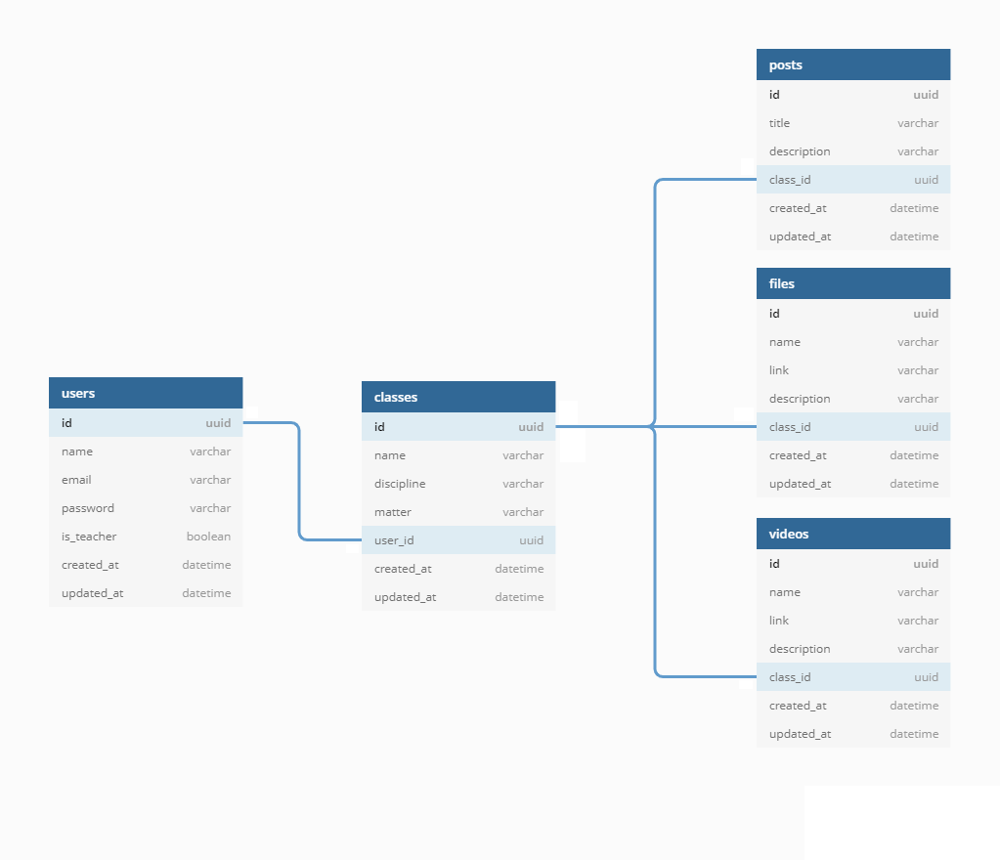

# [DoWhile] DoLearn+ 

# 💻 Sobre o projeto

Nesse projeto o usuário poderá se cadastrar como professor para o compartilhamento de arquivos, vídeos, posts e principalmente conhecimento. O usuário também poderá se cadastrar como aluno e ter acesso aos arquivos, vídeos e posts de todos os professores.

# 🔍 Como instalar

Clone o respositorio e instale as dependencias
```
git clone https://github.com/gustmends/dolearn.git
cd dolearn
yarn
```
---
apos a instalação rode o prisma para criar o banco de dados
```
yarn prisma migrate dev
```
---
Caso queira importar o request collection no insomnia:

[](https://insomnia.rest/run/?label=doLearn%2B%20Request%20Sample&uri=https%3A%2F%2Fraw.githubusercontent.com%2Fgustmends%2Fdolearn%2Fmaster%2Fdocs%2FdoLearnPlus-insomnia.json)

# 📖 Comandos

para testar a aplicação use:
```
yarn dev
```
---
para compilar a aplicação para sua versão final use:
```
yarn build
```
---
para executar a versão compilada use:
```
yarn start
```
---
para rodar o jest use:
```
yarn test
```
---
para abrir o prisma studio use:
```
yarn studio
```
---
para abrir o prisma studio com o banco de dados de teste do jest use:

```
yarn studio:test
```
# 🚀 Rotas da aplicação

## POST `/users`

A rota deve receber, no corpo da requisição, o `name`, `email`, `password` e `is_teacher` e retornar os dados do usuário criado pelo corpo da resposta.

## PATCH `/users`

A rota pode receber os parâmetros `name` e `email` dentro do corpo da requisição e alterar as informações de um usuário.

## POST `/users/login`

A rota deve receber, no corpo da requisição, o `email` e `password` e retornar os dados do usuário criado pelo corpo da resposta.

## GET `/users/classes`

A rota deve retornar no corpo da resposta os dados dos `videos`, `posts` e `files` no corpo da resposta.

## GET `/classes`

A rota pode receber, no corpo da consulta, o `name`, `discipline`, `matter` e `page` e retornas os dados das salas pelo corpo da resposta.

## POST `/classes`

A rota deve receber, nos parâmetros da consulta, o `name`, `discipline` e `matter` e retornas os dados da sala criada pelo corpo da resposta.

## GET `/classes/:class_id`

A rota deve receber, nos parâmetros da rota, o `id` de uma sala e retornar as informações da sala pelo corpo da resposta.

## PATCH `/classes/:class_id`

A rota deve receber, nos parâmetros da rota, o `id` de uma sala e a rota pode receber os parâmetros `name`, `discipline` e `matter` dentro do corpo da requisição e alterar as informações de uma sala.

## DELETE `/classes/:class_id`

A rota deve receber, nos parâmetros da rota, o `id` de uma sala e marcar a mesma como excluída no banco de dados.

## GET `/classes/:class_id/contents`

A rota deve receber, nos parâmetros da rota, o `id` de uma sala e retornas os dados de vídeo, arquivos e posts criados na sala no corpo da resposta.

## POST `/classes/:class_id/contents/files`

A rota deve receber, nos parâmetros da rota, o `id` de uma sala e a rota deve receber, no corpo da requisição, o `name`, `link` e `description` e retornar os dados do arquivo criado no corpo da resposta.

## PATCH `/classes/:class_id/contents/files/:file_id`

A rota deve receber, nos parâmetros da rota, o `class_id` e `file_id` e a rota pode receber os parâmetros `name`, `link` e `description` dentro do corpo da requisição e alterar as informações de uma arquivo.

## GET `/classes/:class_id/contents/files`

A rota deve receber, nos parâmetros da rota, o `id` de uma sala e retornar os dados dos arquivos encontrado no corpo da resposta.

## GET `/classes/:class_id/contents/files/:file_id`

A rota deve receber, nos parâmetros da rota, o `class_id` e `file_id` e retornar os dados do arquivo encontrado no corpo da resposta.

## DELETE `/classes/:class_id/contents/files/:file_id`

A rota deve receber, nos parâmetros da rota, o `class_id` e `file_id` e deletar um arquivo postado.

## POST `/classes/:class_id/contents/videos`

A rota deve receber, nos parâmetros da rota, o `id` de uma sala e a rota deve receber, no corpo da requisição, o `name`, `link` e `description` e retornar os dados do vídeo criado no corpo da resposta.

## PATCH `/classes/:class_id/contents/videos/:video_id`

A rota deve receber, nos parâmetros da rota, o `class_id` e `video_id` e a rota pode receber os parâmetros `name`, `link` e `description` dentro do corpo da requisição e alterar as informações de uma vídeo.

## GET `/classes/:class_id/contents/videos`

A rota deve receber, nos parâmetros da rota, o `id` de uma sala e retornar os dados dos vídeos encontrados no corpo da resposta.

## GET `/classes/:class_id/contents/videos/:video_id`

A rota deve receber, nos parâmetros da rota, o `class_id` e `video_id` e retornar os dados do vídeos encontrados no corpo da resposta.

## DELETE `/classes/:class_id/contents/videos/:video_id`

A rota deve receber, nos parâmetros da rota, o `class_id` e `video_id` e deletar um vídeo postado.

## POST `/classes/:class_id/contents/posts`

A rota deve receber, nos parâmetros da rota, o `id` de uma sala e a rota deve receber, no corpo da requisição, o `title` e `description` e retornar os dados do post criado no corpo da resposta.

## PATCH `/classes/:class_id/contents/posts/:post_id`

A rota deve receber, nos parâmetros da rota, o `class_id` e `post_id` e a rota pode receber os parâmetros `title` e `description` dentro do corpo da requisição e alterar as informações de uma post.

## GET `/classes/:class_id/contents/posts`

A rota deve receber, nos parâmetros da rota, o `id` de uma sala e retornar os dados dos posts encontrados no corpo da resposta.

## GET `/classes/:class_id/contents/posts/:post_id`

A rota deve receber, nos parâmetros da rota, o `class_id` e `post_id` e retornar os dados do post encontrado no corpo da resposta.

## DELETE `/classes/:class_id/contents/posts/:post_id`

A rota deve receber, nos parâmetros da rota, o `class_id` e `file_id` e deletar um post.

# ⚙ Regras de negocio

- POST `/users`
    - [x]  Should be able to create new users as studant
    - [x]  Should be able to create new users as teacher
    - [x]  Should not be able to create new users when email is already taken
    - [x]  Should not be able to create new users when name, email or password not is setted
- PATCH `/users`
    - [x]  Should be able to change user email and name
    - [x]  Should not be able to change user is_teacher
    - [x]  Should not be able to change informations if user is not authenticated
    - [x]  Should not be able to change email for a existing email
- POST `/users/login`
    - [x]  Should be able to login as studant
    - [x]  Should be able to login as teacher
    - [x]  Should not able to login with invalid credentials
- GET `/users/classes`
    - [x]  Should be able to list user classes
    - [x]  Should not be able to list user classes if user not is a teacher
    - [x]  Should not be able to list user classes if user not is authenticated
- GET `/classes`
    - [x]  Should be able to list classes as teacher
    - [x]  Should be able to list classes as studant
    - [x]  Should be able to filter list with query paramters
    - [x]  Should not be able to list classes if user not is authenticated
- POST `/classes`
    - [x]  Should be able to create classes
    - [x]  Should not be able to create classes if user is not a teatcher
    - [x]  Should not be able to create classes if post paramters is not setted
    - [x]  Should not be able to create classes if user not is authenticated
- GET `/classes/:class_id`
    - [x]  Should be able to view class informations as teacher
    - [x]  Should be able to view class informations as studant
    - [x]  Should not be able to view class informations if class not exists
    - [x]  Should not be able to view class informations if user not is authenticated
- PATCH `/classes/:class_id`
    - [x]  Should be able to update class information if user is teacher
    - [x]  Should not be able to update class information if user is studant
    - [x]  Should not be able to update class information if class not exists
    - [x]  Should not be able to update class information if user not is authenticated
- DELETE `/classes/:class_id`
    - [x]  Should be able to delete class
    - [x]  Should not be able to delete class if not is teacher
    - [x]  Should not be able to delete others class as teacher
    - [x]  Should not be able to delete a non existing class
    - [x]  Should not be able to delete a class if user not is authenticated
- GET `/classes/:class_id/contents`
    - [x]  Should be able to list class contents as teacher
    - [x]  Should be able to list class contents as studant
    - [x]  Should not be able to list class contents if user is not authenticated
- POST `/classes/:class_id/contents/files`
    - [x]  Should be able to create class files
    - [x]  Should not be able to create class files if class not exists
    - [x]  Should not be able to create class files if user is not teacher
    - [x]  Should not be able to create class files if user is not owner
    - [x]  Should not be able to create class files with invalid inputs
    - [x]  Should not be able to create class files if user is not authenticated
- PATCH `/classes/:class_id/contents/files/:file_id`
    - [x]  Should be able to change files setting in class
    - [x]  Should not be able to change files setting from others class
    - [x]  Should not be able to change files setting of a non existing files
    - [x]  Should not be able to change files setting of a non existing class
    - [x]  Should not be able to change files setting with invalid paramters
    - [x]  Should not be able to change files setting from class if user is not teacher
    - [x]  Should not be able to change files setting from class if user is not authenticated
- GET `/classes/:class_id/contents/files`
    - [x]  Should be able to list files as teacher
    - [x]  Should be able to list files as studant
    - [x]  Should be able to filter list with query paramters
    - [x]  Should not be able to list files if user not is authenticated
- GET `/classes/:class_id/contents/files/:file_id`
    - [x]  Should be able to show class file as teacher
    - [x]  Should be able to show class file as user
    - [x]  Should not able to show class file of a non existing class
    - [x]  Should not able to show class file of a non existing file
    - [x]  Should be able to show class file if user is not authenticated
- DELETE `/classes/:class_id/contents/files/:file_id`
    - [x]  Should be able to delete class file as teacher
    - [x]  Should not be able to delete class file as studant
    - [x]  Should not be able to delete others class files
    - [x]  Should not be able to delete class file if file not exists
    - [x]  Should not be able to delete class file if class not exists
    - [x]  Should not be able to delete class file is user is not authenticated
- POST `/classes/:class_id/contents/videos`
    - [x]  Should be able to create class videos
    - [x]  Should not be able to create class videos if class not exists
    - [x]  Should not be able to create class videos if user is not teacher
    - [x]  Should not be able to create class videos if user is not owner
    - [x]  Should be able to create class videos
    - [x]  Should not be able to create class videos if user is not authenticated
- PATCH `/classes/:class_id/contents/videos/:video_id`
    - [x]  Should be able to change videos setting in class
    - [x]  Should not be able to change videos setting from others class
    - [x]  Should not be able to change videos setting of a non existing videos
    - [x]  Should not be able to change videos setting of a non existing class
    - [x]  Should not be able to change videos setting with invalid paramters
    - [x]  Should not be able to change videos setting from class if user is not teacher
    - [x]  Should not be able to change videos setting from class if user is not authenticated
- GET `/classes/:class_id/contents/videos`
    - [x]  Should be able to list videos as teacher
    - [x]  Should be able to list videos as studant
    - [x]  Should be able to filter list with query paramters
    - [x]  Should not be able to list videos if user not is authenticated
- GET `/classes/:class_id/contents/videos/:video_id`
    - [x]  Should be able to show class video as teacher
    - [x]  Should be able to show class video as user
    - [x]  Should not able to show class video of a non existing class
    - [x]  Should not able to show class video of a non existing video
    - [x]  Should be able to show class video if user is not authenticated
- DELETE `/classes/:class_id/contents/videos/:video_id`
    - [x]  Should be able to delete class video as teacher
    - [x]  Should not be able to delete class video as studant
    - [x]  Should not be able to delete others class videos
    - [x]  Should not be able to delete class video if video not exists
    - [x]  Should not be able to delete class video if class not exists
    - [x]  Should not be able to delete class video is user is not authenticated
- POST `/classes/:class_id/contents/posts`
    - [x]  Should be able to create class posts
    - [x]  Should not be able to create class posts if class not exists
    - [x]  Should not be able to create class posts if user is not teacher
    - [x]  Should not be able to create class posts if user is not owner
    - [x]  Should be able to create class posts
    - [x]  Should not be able to create class posts if user is not authenticated
- PATCH `/classes/:class_id/contents/posts/:post_id`
    - [x]  Should be able to change posts setting in class
    - [x]  Should not be able to change posts setting from others class
    - [x]  Should not be able to change posts setting of a non existing posts
    - [x]  Should not be able to change posts setting of a non existing class
    - [x]  Should not be able to change posts setting with invalid paramters
    - [x]  Should not be able to change posts setting from class if user is not teacher
    - [x]  Should not be able to change posts setting from class if user is not authenticated
- GET `/classes/:class_id/contents/posts`
    - [x]  Should be able to list posts as teacher
    - [x]  Should be able to list posts as studant
    - [x]  Should be able to filter list with query paramters
    - [x]  Should not be able to list posts if user not is authenticated
- GET `/classes/:class_id/contents/posts/:post_id`
    - [x]  Should be able to show class post as teacher
    - [x]  Should be able to show class post as user
    - [x]  Should not able to show class post of a non existing class
    - [x]  Should not able to show class post of a non existing post
    - [x]  Should be able to show class post if user is not authenticated
- DELETE `/classes/:class_id/contents/posts/:post_id`
    - [x]  Should be able to delete class post as teacher
    - [x]  Should not be able to delete class post as studant
    - [x]  Should not be able to delete others class posts
    - [x]  Should not be able to delete class post if post not exists
    - [x]  Should not be able to delete class post if class not exists
    - [x]  Should not be able to delete class post is user is not authenticated

# 🗃 Banco de dados



- Users
    - id `uuid`
    - name `varchar`
    - email `varchar`
    - password `varchar`
    - is_teacher `boolean`
    - created_at `datetime`
    - updated_at `datetime`
- Classes
    - id `uuid`
    - name `varchar`
    - discipline `varchar`
    - matter `varchar`
    - user_id `uuid`
    - created_at `datetime`
    - updated_at `datetime`
- Posts
    - id `uuid`
    - title `varchar`
    - description `varchar`
    - class_id `uuid`
    - created_at `datetime`
    - updated_at `datetime`
- Files
    - id `uuid`
    - name `varchar`
    - link `varchar`
    - description `varchar`
    - class_id `uuid`
    - created_at `datetime`
    - updated_at `datetime`
- Videos
    - id `uuid`
    - name `varhcar`
    - link `varchar`
    - description `varchar`
    - class_id `uuid`
    - created_at `datetime`
    - updated_at `datetime`